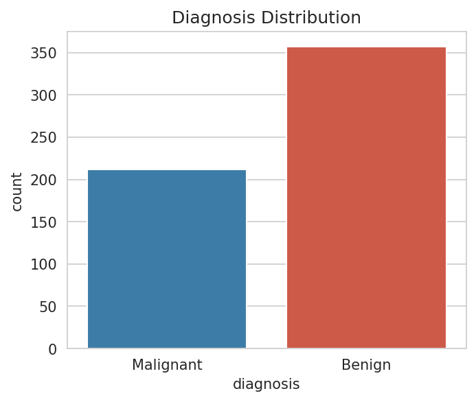
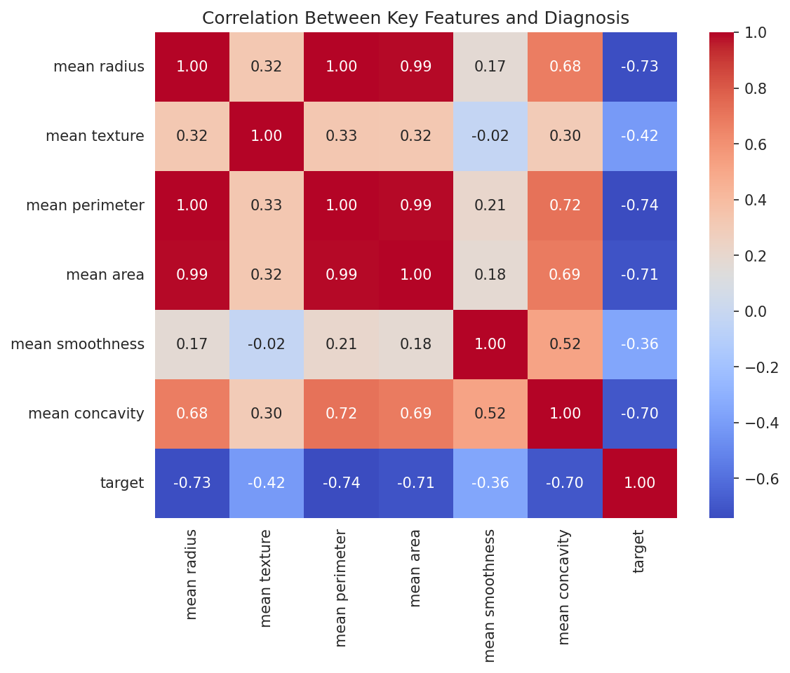
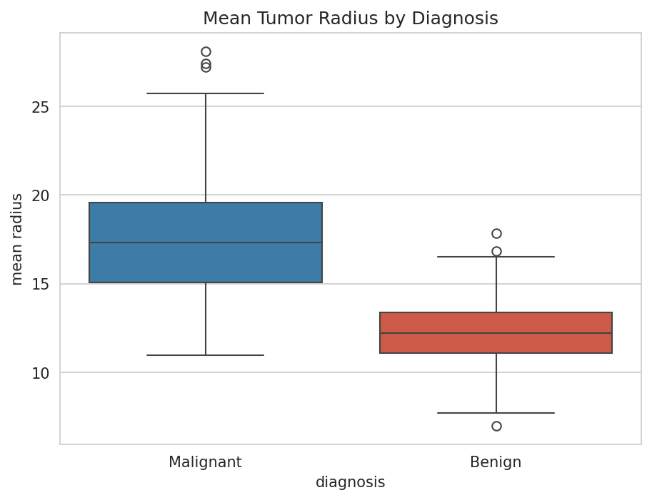
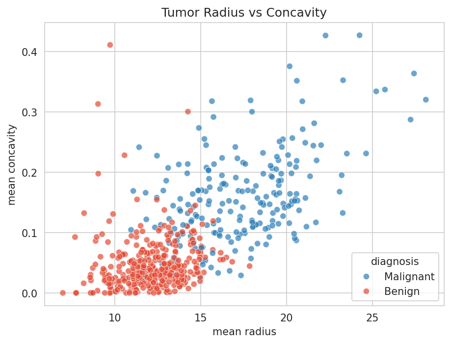

# Breast Cancer Diagnostic Data Analysis

Exploratory data analysis of the Wisconsin Breast Cancer diagnostic dataset (569 patient records, 30 numeric features) using Python.

## Problem Statement
Analyzed tumor measurement data to identify which features are most strongly associated with malignant vs. benign diagnoses, using statistical summaries and visualizations.

## Tools Used
Python · Pandas · NumPy · Matplotlib · Seaborn · scikit-learn

## Key Findings
- The dataset contains 357 benign and 212 malignant cases — a moderate class imbalance worth accounting for in any future classification work.
- `mean radius`, `mean perimeter`, and `mean area` are almost perfectly correlated with each other (expected, since they all measure tumor size) and show strong negative correlation with the diagnosis label — larger tumors trend malignant.
- Malignant tumors show a visibly higher median radius and wider spread than benign tumors.
- Tumors with both high radius and high concavity cluster heavily in the malignant class, suggesting these two features together could strongly separate the classes in a future classification model.

## Visualizations

## Dataset
[Wisconsin Breast Cancer Diagnostic Dataset](https://scikit-learn.org/stable/datasets/toy_dataset.html#breast-cancer-dataset) (via `sklearn.datasets`)
